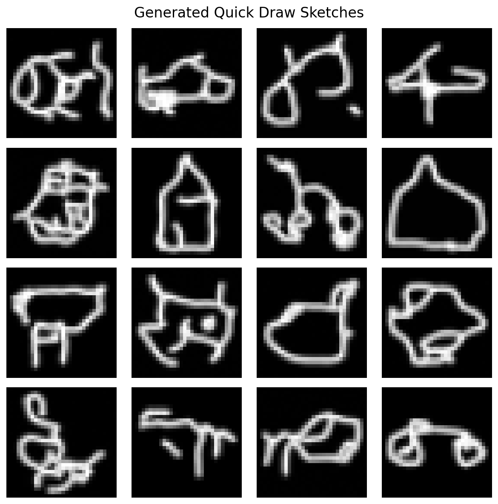

# Quick Draw AI Sketch Generator

A lightweight diffusion-based AI model that generates hand-drawn sketches inspired by Google’s Quick Draw dataset.

This project demonstrates how a U-Net–based diffusion model can generate simple grayscale sketches efficiently, even under limited GPU memory constraints.

---

## 🎨 Example Output



*Example sketch generated by the trained diffusion model.*

---

## 🚀 What You Get

* AI model that generates sketch-style drawings (e.g., cats, dogs, cars)
* Diffusion model with U-Net, residual blocks, and self-attention
* Runs inside a Docker container
* Compatible with Windows 11
* No training required to generate sketches (pretrained inference supported)

---

## 📁 Project Structure

```
├── inference.py          # Script to generate sketches (inference)
├── train.py              # Training script (optional)
├── generated_sketches.png# Sample generated output
├── requirements.txt      # Python dependencies
└── README.md             # Project documentation
```

---

## 🧠 Model Overview

* Image size: **32×32 grayscale**
* Architecture: **U-Net with residual blocks and self-attention**
* Training objective: Predict noise using **MSE loss**
* Optimized using mixed-precision training and gradient checkpointing

---

## ▶️ Quick Start (Inference)

```bash
pip install -r requirements.txt
python inference.py
```

Generated sketches will be saved locally.

---

## 🛠️ Training (Optional)

```bash
python train.py
```

Training is optional and intended for experimentation or further fine-tuning.

---

## 📌 Notes

* Designed to run on limited GPU resources (e.g., NVIDIA T4, 16GB VRAM)
* Focuses on architectural clarity and efficiency rather than high-resolution output

---

## 📄 License

This project is for educational and research purposes.
